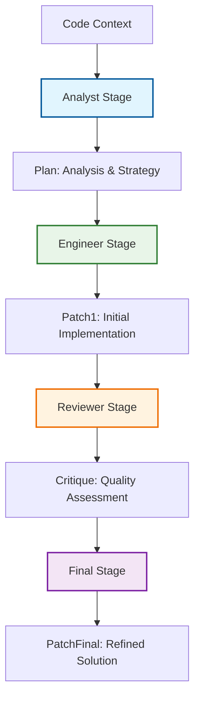
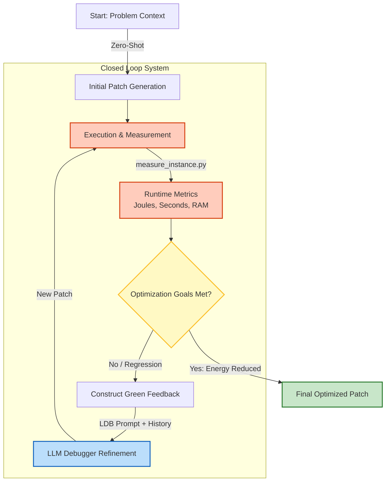

# PHASE 2: PROMPTING STRATEGIES & EXPERIMENTAL DESIGN
# PART 1: Introduction

## 1. Introduction and Objectives
The goal of Phase 2 is to evaluate the capabilities of Large Language Models (LLMs) in performing **Green Code Refactoring**. Unlike traditional code generation tasks focused solely on functional correctness, this phase introduces a multi-dimensional objective function:
1.  **Reduce Energy Consumption** (CPU/GPU Joules).
2.  **Minimize Execution Time** (Performance).
3.  **Optimize Memory Usage** (Peak RAM).
4.  **Maintain Functional Correctness** (Pass all tests).

To achieve this, we implemented a robust Prompt Engineering architecture designed to guide models away from generic "clean code" towards specific "energy-efficient patterns".

---

## 2. The 4x2 Experimental Matrix
The core of our methodology is a factorial design (4 Strategies $\times$ 2 Contexts) resulting in 8 distinct experimental settings per instance. This allows us to decouple the model's **reasoning capability** from its **context retrieval capability**.

| Strategy / Context | **Oracle** (Upper Bound) | **Realistic** (RAG/Retrieval) |
| :--- | :--- | :--- |
| **1. Zero-Shot** | `ZS_Oracle` | `ZS_Realistic` |
| **2. Chain-of-Thought (CoT)** | `CoT_Oracle` | `CoT_Realistic` |
| **3. Self-Collaboration** | `SC_Oracle` | `SC_Realistic` |
| **4. LDB (Iterative)** | `LDB_Oracle` | `LDB_Realistic` |

---

## 3. Context Definitions

### A. Oracle Context (The "Perfect Knowledge" Scenario)
In this setting, we assume the localization step has been performed perfectly. The model is provided with:
* **Target Functions:** The exact list of functions/methods that need optimization.
* **Filtered Files:** Only the files relevant to the target functions, minimizing noise.
* **Specific Instructions:** Explicit directives on what to optimize (e.g., *"Focus on optimizing function `calculate_flux` in `core.py`"*).

* **Goal:** Assess the LLM's raw algorithmic intelligence and ability to refactor for energy efficiency when the "where to look" problem is solved.

### B. Realistic Context (The "Wild" Scenario)
This setting simulates a real-world software engineering workflow where the developer knows something is slow but not exactly where. The model is provided with:
* **Symptoms:** The command or name of the failing/inefficient test (e.g., *"Test `test_large_matrix_multiplication` is consuming excessive energy"*).
* **Retrieval (BM25):** A set of files retrieved via a standard retrieval algorithm (BM25), which may include irrelevant files ("noise").
* **Task:** The model must first **identify** the bottleneck within the noisy context and then **optimize** it.

* **Goal:** Assess the LLM's ability to filter noise, diagnose performance issues from test signals, and perform localized refactoring.

# Part 2: Common Prompt Components

## 4. The "Green Engineer" System Person

Across all experimental strategies, we define a specific System Person to prime the Large Language Model. Instead of a generic "coding assistant" role, we explicitly cast the model as a domain expert.

**Prompt String:**
```
You are an expert in Green Software Engineering. Your goal is to refactor code to minimize energy consumption and carbon emissions while maintaining strict functional correctness.
```

**Scientific Rationale:** By utilizing Role-Playing Prompting, we aim to activate the model's latent knowledge regarding efficiency patterns (e.g., avoiding redundant computations, minimizing memory allocations) that might not be prioritized in a standard code completion task.

## 5. Multidimensional Optimization Goals

Standard refactoring often focuses on readability or speed. For this project, we inject a set of Green Optimization Goals into every prompt to align the model's objective function with our physical measurements.

### The 4 Pillars:

1. **Reduce CPU Energy Consumption (Joules):** The primary metric, measured via RAPL/EnergiBridge.
2. **Reduce Wall-clock Execution Time:** Often correlated with energy, but not always (e.g., race-to-sleep strategies).
3. **Minimize Memory Spikes (Peak RAM):** Reducing memory footprint reduces energy cost of data movement and garbage collection.
4. **Maintain 100% Functional Correctness:** The constraint that the refactoring must pass all existing tests.

This explicit instruction forces the model to treat energy as a first-class citizen, rather than a byproduct of speed.

## 6. Output Interface: SWE-perf Compatibility

To ensure the generated patches can be automatically applied and measured without human intervention, all prompts strictly enforce the SEARCH/REPLACE block format defined by the original SWE-perf benchmark.

### Format Specification:

```
<<<<<<< SEARCH
[Original Code Lines]
=======
[Optimized Code Lines]
>>>>>>> REPLACE
```

**Why this matters:** This format allows our pipeline to parse the LLM's response deterministically. If the model generates valid Python code but fails to wrap it in these blocks, the attempt is marked as a format error, ensuring that only structurally valid patches reach the measurement phase.

---

# Part 3a: Strategy SINGLE TURN 1 - [Zero-Shot]
## 7. Strategy Overview: Zero-Shot

The Zero-Shot strategy serves as the fundamental baseline for our experiments. In this configuration, the Large Language Model is presented with the problem context and the optimization goals directly, without being provided with examples of similar solved problems (Few-Shot) or being forced to produce intermediate reasoning steps (Chain-of-Thought).

* **Scientific Role:** It establishes the "raw" capability of the model. Any improvement observed in subsequent strategies (CoT, Agents) represents the "value added" by prompt engineering techniques.
* **Prompt Structure:**
`[System Persona] + [Premise] + [Problem Statement] + [Code Context] + [Format Instructions]`

---

## 8. Context Adaptation (Oracle vs. Realistic)

While the core structure remains identical, the **Problem Statement** block changes significantly depending on the experimental setting defined in `zero_shot_template.py`.

### A. Zero-Shot Oracle (`ZS_Oracle`)

In this setting, the prompt acts as a direct directive. We assume the "Diagnosis" phase has been solved by a human or a perfect localizer.

* **Logic:** The prompt explicitly points to the bottleneck functions.
* **Template Logic:**
```python
if context.problem_statement_type == ProblemStatementType.ORACLE:
    targets = context.get_target_functions_str()
    problem_body = (
        f"{context.problem_description}\n"
        f"{green_guidelines}\n"
        f"Focus on optimizing these specific targets:\n{targets}"
    )

```


* **What the Model Sees:**
> "...Focus on optimizing these specific targets: function `compute_flux` in `flux.py`..."


### B. Zero-Shot Realistic (`ZS_Realistic`)

In this setting, the prompt acts as a "Bug Report" or "Performance Ticket". The model receives symptoms (failing tests) and a noisy set of files.

* **Logic:** The model must infer the location of the inefficiency based on the test name/output and the file contents.
* **Template Logic:**
```python
else:
    # Realistic: Focus on symptoms (tests)
    problem_body = (
        f"REALISTIC SETTING: The following tests are showing poor energy performance:\n"
        f"{context.test_command}\n\n"
        f"{green_guidelines}\n"
        "Analyze the provided repository context (files retrieved via BM25), "
        "identify the bottleneck causing the high consumption, and optimize it."
    )

```


* **What the Model Sees:**
> "REALISTIC SETTING: The following tests are showing poor energy performance: `pytest tests/test_simulation.py::test_heavy_load`. Analyze the provided repository context..."


---

## 9. Code Context Presentation

To maximize compatibility with the SWE-perf evaluation harness, code files are presented using XML-style tags, but line numbers are intentionally omitted in the final prompt generation (`add_line_numbers=False`).

* **Rationale:** While line numbers help in chat interfaces, they often confuse LLMs when generating `SEARCH/REPLACE` blocks, as the model might try to match the line number string instead of the content string.
* **Implementation:**
```python
code_block = f"<code>\n{context.get_formatted_code(add_line_numbers=False)}\n</code>"

```
---

# Part 3b: Strategy SINGLE TURN 2 - [Chain-of-Thought (CoT)]

## 10. Strategy Overview: Single-Turn CoT

Standard Large Language Models often fail at complex optimization tasks because they attempt to generate the solution code immediately (System 1 thinking). The **Chain-of-Thought (CoT)** strategy forces the model to engage in a reasoning process (System 2 thinking) before writing a single line of code.

* **Scientific Basis:**
* **Wei et al. (2022):** "Chain-of-Thought Prompting Elicits Reasoning in Large Language Models".
* **Kojima et al. (2022):** "Large Language Models are Zero-Shot Reasoners".


* **The "Magic Spell":** We explicitly inject the trigger phrase **"Let's think step by step"** into the prompt. Research shows this specific string maximizes the model's ability to decompose complex problems without needing few-shot examples.

---

## 11. The Green Reasoning Structure

Unlike generic CoT, we do not let the model wander aimlessly. We enforce a structured **Reasoning Path** tailored to Green Software Engineering. The prompt requires the output to be split into two strict sections: `SECTION 1: ANALYSIS` and `SECTION 2: PATCH`.

### The Analysis Pillars

Inside the analysis section, the model must address three specific points:

1. **Identification (The "Where"):**
* *Oracle Mode:* Analyze the target function's complexity.
* *Realistic Mode:* Filter the retrieved files to find the "Hotspot" and discard noise.


2. **Diagnosis (The "Why"):**
* Explain the inefficiency in physical terms (e.g., "This nested loop creates O(N^2) complexity on the CPU," or "Repeated string concatenation causes memory spikes").


3. **Hypothesis (The "What if"):**
* Predict the impact of the proposed fix (e.g., "Using a Set for lookups will reduce complexity to O(1), saving CPU cycles").


---

## 12. Implementation Details

The `CoTTemplate` class implements a robust parsing mechanism to separate the reasoning from the code.

* **Prompt Injection:**
```python
cot_instructions = """
SECTION 1: ANALYSIS
Start this section by writing: "Let's think step by step."
...
SECTION 2: PATCH
Only after the analysis is complete, provide the SEARCH/REPLACE block.
"""

```


* **Extraction Logic:**
The `extract_code_from_response` method is designed to discard everything before the `SECTION 2: PATCH` marker. This ensures that the verbose reasoning text does not confuse the SWE-perf patch applicator.

---

# Parte 4a: Strategy 3 (MULTI TURN) - [Self-Collaboration (Multi-Agent)]

## 13. Strategy Overview: The AgentCoder Paradigm

Complex software engineering tasks require distinct cognitive modes: high-level planning, low-level implementation, and critical verification. When forced to perform all these simultaneously (Zero-Shot), LLMs often suffer from attention degradation.

Our **Self-Collaboration** strategy implements a Multi-Turn dialogue system where the LLM adopts different "Personas" to mimic a real-world engineering team workflow.

* **Scientific Reference:**
* Du et al. (2024) - *"AgentCoder: Multi-Agent-based Code Generation with Iterative Testing and Optimisation"*.
* Dong et al. (2023) - *"Self-Collaboration Code Generation via ChatGPT"*.


* **Mechanism:** Instead of a single prompt, we orchestrate a sequence of **4 distinct turns**, passing the output of one role as the input for the next.

---

## 14. Green Role Definitions

We have adapted the generic roles found in literature to specific **Green Software** roles:

1. **Turn 1: Sustainability Analyst (The Diagnosis)**
* **Persona:** *"You are a Sustainability Analyst specialized in Green Software. Your role is NOT to write code, but to diagnose inefficiencies."*
* **Goal:** Analyze the context (Oracle or Realistic) and output a structured list of **Optimization Goals** (e.g., "Replace recursion with iteration to reduce stack memory overhead").
* **Output:** Natural language plan.


2. **Turn 2: Senior Refactoring Engineer (The Implementation)**
* **Persona:** *"You are a Senior Refactoring Engineer. Your goal is to implement the optimizations proposed by the Analyst."*
* **Input:** Original Code + Analyst's Plan.
* **Output:** Initial Code Patch (SEARCH/REPLACE block).


3. **Turn 3: Critical Reviewer (The Verification)**
* **Persona:** *"You are a Critical Code Reviewer. Your job is to find bugs or missed green opportunities."*
* **Input:** Original Code + Engineer's Patch + Analyst's Plan.
* **Task:** Verify if the patch actually addresses the energy goals and maintains correctness.
* **Output:** Critique (LGTM or list of issues).


4. **Turn 4: Engineer (Final Polish)**
* **Task:** Refine the patch based on the critique.


---

## 15. Implementation: The Template Manager Facade

Unlike single-turn strategies, Self-Collaboration requires state management. The `SelfCollaborationTemplate` class exposes specific methods (`get_analyst_prompt`, `get_engineer_prompt`, etc.) which are orchestrated by the execution loop.

* **Workflow Logic:**

### Visualizing the Workflow


Ottima idea. Visualizzare il flusso logico è fondamentale per la tesi.

Inserisci questo blocco Mermaid **alla fine della "Part 5"** che abbiamo appena scritto (dopo il paragrafo 15). Rappresenta graficamente il passaggio di consegne tra i ruoli.

```markdown
### Visualizing the Workflow


---

Ora procediamo con la **Parte 6**.
Questa è la sezione tecnicamente più avanzata: **LDB (Iterative Debugging)**. Qui spieghiamo come il sistema non si limiti a "scrivere" codice, ma "impari" dai propri errori energetici usando i dati reali misurati (il codice che abbiamo scritto in `ldb_template.py`).

Copia questo blocco e incollalo di seguito nel file `docs/PHASE2_PROMPTING_STRATEGIES_DETAILS.md`.

---

# Parte 4b: Strategy 4 (MULTITURN) - [LDB (Iterative Debugging)]

## 16. Strategy Overview: Runtime Verification

The previous strategies (Zero-Shot, CoT, Self-Collaboration) operate in an "Open Loop": the model generates code based solely on its training data and the prompt. However, code that looks efficient often behaves differently on real hardware.

**LDB (Large Language Model Debugger)** introduces a "Closed Loop" system where the model iterates based on **Ground Truth** execution data.

* **Scientific Reference:** Zhong et al. (2024) - *"LDB: A Large Language Model Debugger via Verifying Runtime Execution Step-by-step"*.
* **Core Concept:** Instead of asking the model to "try again" blindly (Re-Sampling), we feed back the exact runtime metrics to guide the correction.

---

## 17. Green Feedback Adaptation

In the original LDB paper, the feedback consists of stack traces (Runtime Errors) or variable values. For Green Code Refactoring, we developed a specialized **Green Feedback Mechanism**.

Instead of reporting *correctness* failures, we report *efficiency* failures. The feedback block injected into the prompt includes:

1. **Energy Delta:** "CPU Energy: 45J  44.8J (Change: -0.4%) [TARGET NOT MET]".
2. **Performance Regression:** "Execution Time: 5.0s  5.1s (Slower)".
3. **Resource Usage:** "Peak RAM: 150MB  200MB".

This transforms the debugging task from *"Fix the bug"* to *"Fix the energy consumption"*.

---

## 18. Implementation: The `LDBTemplate`

The logic is encapsulated in `src/prompt_templates/ldb_template.py`. The process follows a strict state machine:

1. **Step 0 (Genesis):** An initial patch is generated using the Zero-Shot strategy.
2. **Step 1 (Measurement):** The system runs `measure_instance.py`.
3. **Step 2 (Feedback Construction):** The measurement JSON is parsed by `format_feedback_from_measurement`.
4. **Step 3 (Refinement Prompt):** The LDB template constructs a prompt containing:
* The **Previous Patch** (Context).
* The **Execution Feedback** (Ground Truth).
* **Instructions:** *"Diagnose why energy did not improve and propose a new patch."*


* **Prompt Example:**
```text
<execution_feedback>
Runtime analysis from the test server:
1. Test Status: SUCCESS
2. CPU Energy: 45.00J -> 45.20J (Change: +0.44%) ⚠️ INCREASED
</execution_feedback>

INSTRUCTIONS:
Diagnose why energy increased. Propose a NEW patch.

```

### Visualizing the LDB Feedback Loop

